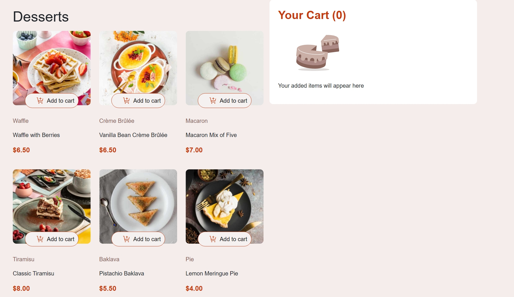

# Frontend Mentor - Product list with cart solution

This is a solution to the [Product list with cart challenge on Frontend Mentor](https://www.frontendmentor.io/challenges/product-list-with-cart-5MmqLVAp_d). Frontend Mentor challenges help you improve your coding skills by building realistic projects. 

## Table of contents

- [Overview](#overview)
  - [The challenge](#the-challenge)
  - [Screenshot](#screenshot)
  - [Links](#links)
- [My process](#my-process)
  - [Built with](#built-with)
  - [What I learned](#what-i-learned)
  - [Continued development](#continued-development)
  - [Useful resources](#useful-resources)
- [Author](#author)
- [Acknowledgments](#acknowledgments)


## Overview
  This was another project on front end developement. Product list with cart is a project that is about building a shopping webpage with cart functionality and in a responsive design manner.
### The challenge

Users should be able to:

- Add items to the cart and remove them
- Increase/decrease the number of items in the cart
- See an order confirmation modal when they click "Confirm Order"
- Reset their selections when they click "Start New Order"
- View the optimal layout for the interface depending on their device's screen size
- See hover and focus states for all interactive elements on the page

### Screenshot




### Links

- Solution URL: (https://github.com/Rodney-Mokenyu/product-list-with-cart-main)
- Live Site URL: ( https://rodney-mokenyu.github.io/product-list-with-cart-main/)

## My process

### Built with

- Semantic HTML5 markup
- CSS custom properties
- Flexbox
- CSS Grid
- Mobile-first workflow
- ChatGPT.com


### What I learned

I learnt about setting and reseting. used in the js to make the product items and the carts interactive.
I also learnt how to include html in js by using innerHtml.
when I try using the json file provided, I am sure i would be able to learn some json too.

To see how you can add code snippets, see below:


```js
 const detailsContainer = document.createElement('div');
    detailsContainer.className = 'order-details';
    if (orderedItems.length) {
      const ul = document.createElement('ul');
      ul.style.paddingLeft = '5px';
      ul.style.textAlign = 'left';
      orderedItems.forEach(item => {
        const li = document.createElement('li');
        li.innerHTML = `<strong>${item.name}</strong> &mdash; ${item.quantity} x $${item.price} = $${item.total}`;
        ul.appendChild(li);
      });
      detailsContainer.appendChild(ul);

      const totalDiv = document.createElement('div');
      totalDiv.style.fontWeight = 'bold';
      totalDiv.style.marginTop = '10px';
      totalDiv.textContent = `Total: $${orderTotal}`;
      detailsContainer.appendChild(totalDiv);
    } else {
      detailsContainer.innerHTML = '<div>No items ordered.</div>';
    }
    const details = document.createElement('div');
    details.style.margin = '16px 0';

    // Helper to get image src for a product name
    function getProductImageSrc(productName) {
      // Try to find the product element by name
      const productEl = Array.from(document.querySelectorAll('.product')).find(
      el => el.querySelector('.product-name') && el.querySelector('.product-name').textContent === productName
      );
      if (productEl) {
      // Try to get the  inside <picture>
      const imgEl = productEl.querySelector('picture img');
      if (imgEl) return imgEl.src;
      }
      // fallback image
      return 'assets/images/default-product-image.svg';
    }

    details.innerHTML = orderedItems.length
      ? `<ul style="padding:10px; text-align:left; display:flex; flex-direction:column; gap:5px; background-color:#FDF6E4;">
      ${orderedItems.map(item =>
      `<li style="list-style:none; margin:0; display:flex; align-items:center; gap:8px; ">
        <div style="display:flex; justify-content:space-evenly; align-items:center; width:100%;">
        
        <div style="margin-left:8px;">
          <strong>${item.name}</strong>
          <span style="display:block; color:gray;">${item.quantity}x  &nbsp $${item.price}</span>
        </div>
        <div style="margin-left:auto; font-weight:bold;">$${item.total}</div>
        </div>
        

      </li>
      <hr style="border: none; height: 0.5px; background-color: lightgray;">`
      ).join('')}
      </ul>
      <div style="font-weight:bold; margin-top:10px;">Total: $${orderTotal}</div>`
      : '<div>No items ordered.</div>';
```


### Continued development

As with most of my projects, I would like to continue developing my js DOM manipulation skills.
- Json knowledge.
- Mobile first workflow.

### Useful resources

- [Example resource 1](https://www.chatGpt.com) - This helped me almost all research and refactoring. I really liked this pattern and will use it going forward.

## Author


- Frontend Mentor - [@Rodney-Mokenyu](https://www.frontendmentor.io/profile/Rodney-Mokenyu)


## Acknowledgments
I really want to appreciate myself for not giving up despite the hurdles faced during this project. I showed some resilience until the very end.

